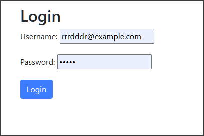
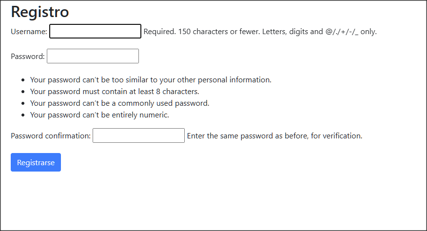
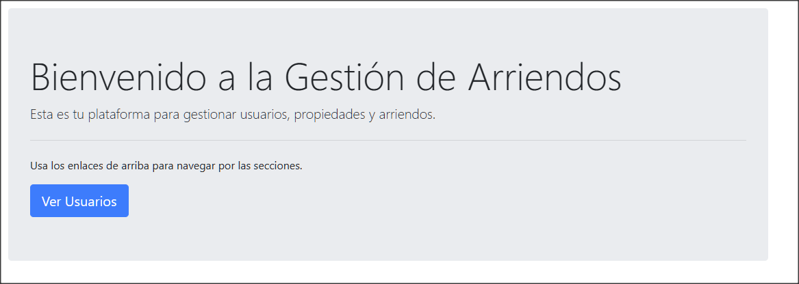
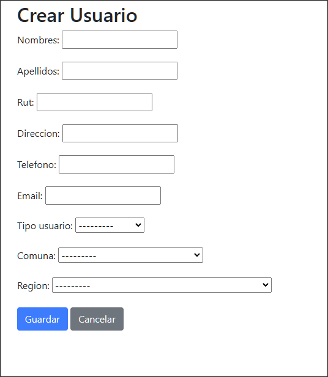
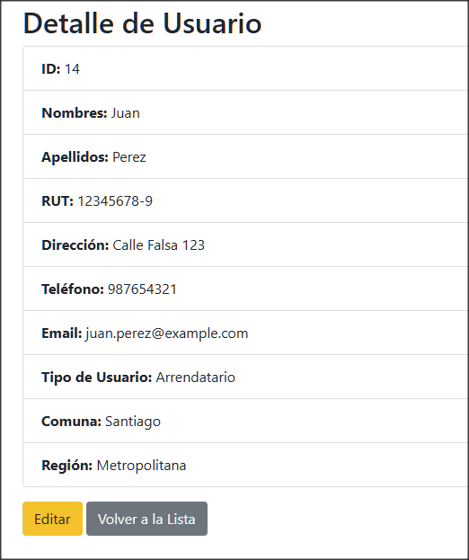
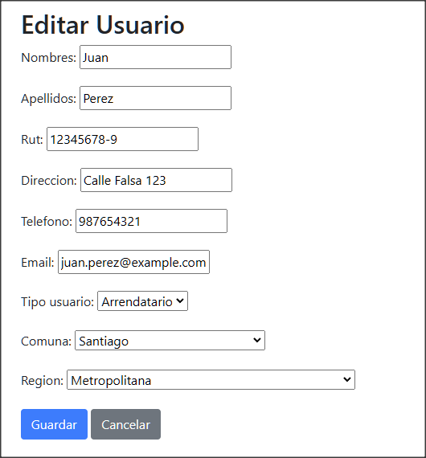

# Proyecto de Gestión de Arriendos

Este proyecto es una aplicación web desarrollada en Django para gestionar el arriendo de inmuebles. Los usuarios pueden registrarse, gestionar propiedades, y realizar solicitudes de arriendo.

## Funcionalidades

- **Usuarios**: Registro y gestión de usuarios.
- **Propiedades**: Registro, actualización y eliminación de inmuebles.
- **Solicitudes de Arriendo**: Creación y gestión de solicitudes de arriendo.
- **Pagos**: Registro de pagos asociados a las solicitudes de arriendo.
- **Autenticación**: Registro, login, logout de usuarios.

## Estructura de la Base de Datos

El proyecto utiliza los siguientes modelos:

- `Usuario`: Gestiona los datos de los usuarios registrados.
- `TipoUsuario`: Define los tipos de usuarios (Arrendatario, Propietario, etc.).
- `Region`: Registra las regiones.
- `Comuna`: Registra las comunas asociadas a una región.
- `Inmueble`: Gestiona la información de los inmuebles disponibles.
- `SolicitudArriendo`: Registra las solicitudes de arriendo realizadas por los usuarios.
- `Pago`: Registra los pagos asociados a las solicitudes de arriendo.

## Requisitos

- Python 3.x
- Django 3.x
- SQLite (base de datos predeterminada)

## Uso de la Aplicación

### 1. Registro de Usuarios

Los usuarios pueden registrarse a través de la página de registro. Una vez registrados, se les redirige automáticamente a la página principal.

### 2. Inicio de Sesión

Los usuarios pueden iniciar sesión utilizando su nombre de usuario y contraseña. Si las credenciales son correctas, serán redirigidos a la página principal.

### 3. Cierre de Sesión

Los usuarios autenticados pueden cerrar sesión en cualquier momento utilizando el botón de logout en la barra de navegación.

### 4. Gestión de Usuarios

- **Lista de Usuarios:** Muestra una lista de todos los usuarios registrados.
- **Crear Usuario:** Permite registrar un nuevo usuario en el sistema.
- **Editar Usuario:** Permite editar los datos de un usuario existente.
- **Eliminar Usuario:** Permite eliminar un usuario del sistema.

## Plantillas

La aplicación utiliza plantillas basadas en Bootstrap para una interfaz simple y responsive. Las plantillas incluyen:

- `base.html`: Plantilla base que incluye la barra de navegación y estructura general.
- `login.html`: Formulario de inicio de sesión.
- `register.html`: Formulario de registro de usuarios.
- `form.html`: Formulario utilizado tanto para crear como para editar usuarios.
- `detail.html`: Muestra los detalles de un usuario específico.
- `list.html`: Muestra una lista de usuarios registrados.

## Navegación en la Aplicación

En la barra de navegación, los usuarios pueden:

- **Ver Usuarios:** Acceder a la lista de usuarios registrados.
- **Registrar:** Crear una nueva cuenta si no están autenticados.
- **Login/Logout:** Iniciar o cerrar sesión según el estado de autenticación.